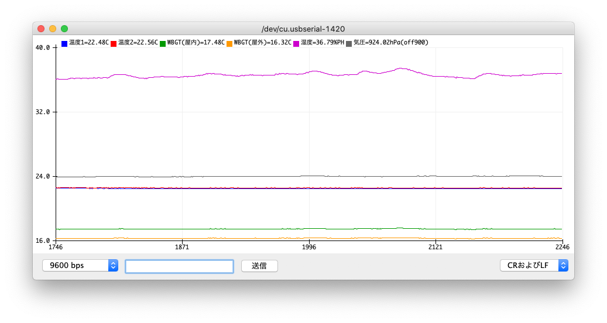

# M5_ENV3.ino

このサンプルスケッチは以下について記述している；

- ENV III（U001-C）実演

## 対象AVR

- megaAVR世代
  - megaAVR-0系統
  - tinyAVR-0/1/2系統
- modernAVR世代
  - AVR Dx系統

## 解説

[[M5Stack : ENV III Unit with Temperature Humidity Air Pressure Sensor (SHT30+QMP6988) SKU: U001-C]](https://shop.m5stack.com/collections/m5-sensor/products/env-iii-unit-with-temperature-humidity-air-pressure-sensor-sht30-qmp6988)
（以下`ENV3`）
は`SHT30`温度＋湿度センサー
と`QMP6988`温度＋気圧センサー
の2個を混載してI2C制御できる複合デバイスだ。
ここではこれらのセンサーから「WBGT」近似値を算出して
シリアルプロッタに出力する。



センサー接続は次のようにする。
__"Zinnia Duino"__ の場合はオンボード上の
Grove/M5互換コネクタに結線するだけで良い。
IOREF選択電圧は3V/5Vどちらでもよい。

```plain
[Sensor]   [modernAVR]
    SCL <-- PIN_PA3
    SDA <-> PIN_PA2
     5V <-- 5V
    GND --> GND
```

> このスケッチは
`GROVE HUB(U006)`を経由して配線分配し、
`APPEND_NCIR`マクロを有効化すれば
`NCIR(U028)`を同時にプロットすることもできる。
配線分配に`I2C HUB(U040-B)`を使う場合は後述の注意事項を参照のこと。

## SHT30

`SHT30`からは温度と湿度を取得することができる。
`update`メソッドが真を返せば最新情報取得に成功し、
`getTemperature`メソッド（単位は摂氏）と
`getHumidity`メソッド（単位はパーセント）でそれぞれが取得できる。

```c
#include <M5_Modules.h>
ENVS_SHT3X ENV3_SHT = {Wire};

/* loop */
ENV3_SHT.update(); /* true is success */
float temp  = ENV3_SHT.getTemperature();
float humi  = ENV3_SHT.getHumidity();
```

さらにその両者から「WBGT」近似値（単位は摂氏）を取得できる。
補正式の違いから室内用（`getWBGTinDoor`）メソッドと
屋外用（`getWBGToutDoor`）メソッドの2種がある。

```c
float wbgti = ENV3_SHT.getWBGTinDoor();
float wbgto = ENV3_SHT.getWBGToutDoor();
```

> `SHT30`のデータフォーマットは`1-Wire`に即した形式で、
「ビッグエンディアン16bit＋8bit CRC（Dallas型）」になっている。
詳細は`<M5_ENV3_SHT3X.h>`を参照のこと。

## QMP6988

`QMP6988`からは温度と気圧を取得することができる。
通電後は使用に先立ち`initialize`メソッドを呼ばなければならない。
`update`メソッドが真を返せば最新情報取得に成功し、
`getTemperature`メソッド（単位は摂氏）と
`getPressure`メソッド（単位はパスカル）でそれぞれが取得できる。

```c
#include <M5_Modules.h>
ENVS_QMP6988 ENV3_QMP = {Wire};

/* setup */
ENV3_QMP.initialize(); /* true is success */

/* loop */
ENV3_QMP.update(); /* true is success */
float temp1 = ENV3_QMP.getTemperature();
float press = ENV3_QMP.getPressure();
```

> `initialize`で校正情報を読み出し、以後の補正式計算に使用する。
詳細は`<M5_ENV3_QMP6988.h>`を参照のこと。

## ENV3使用上の注意

`ENV3`内臓の`QMP6988`の制御アドレスは`0x70`であるが、これは
[[M5Stack : I2C Hub 1 to 6 Expansion Unit (PCA9548APW) SKU: U040-B]](https://shop.m5stack.com/collections/m5-sensor/products/i2c-hub-1-to-6-expansion-unit-pca9548apw)
のそれと同一であって衝突しており、購入状態では同時使用できない。
対策は後者`I2C HUB`を一度分解（要T6型HEXドライバー）し、
ジャンパーパッドを半田ブリッジまたは
1608サイズの 0Ωチップ抵抗を追加することにより制御アドレスを変更するしかない。
`ENV3`のほうは分解してもジャンパーパッドが存在しないので対応不能だ。

## 著作表示

Twitter: [@askn37](https://twitter.com/askn37) \
GitHub: [https://github.com/askn37/](https://github.com/askn37/) \
Product: [https://askn37.github.io/](https://askn37.github.io/)

Copyright (c) askn (K.Sato) multix.jp \
Released under the MIT license \
[https://opensource.org/licenses/mit-license.php](https://opensource.org/licenses/mit-license.php) \
[https://www.oshwa.org/](https://www.oshwa.org/)
